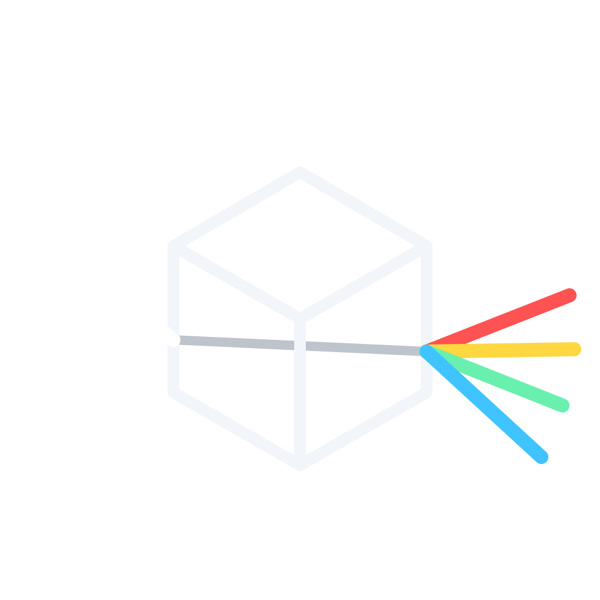

  

# Raydium

**Native Vulkan path tracing for Minecraft.**

Raydium brings real-time, hardware **ray traced** shadows, reflections and colored
lighting to Minecraft, denoised and upscaled with **NVIDIA DLSS Ray Reconstruction**.
It is a fork of [VulkanMod](https://github.com/xCollateral/VulkanMod) and inherits its
native Vulkan rasterizer — so you get VulkanMod's performance *plus* real path tracing
on top, instead of screen-space tricks.

> ⚠️ Raydium is early software (`0.1.0-alpha`). Expect rough edges.

## Features

- **Hardware ray tracing** — real shadows, reflections and refraction (water, glass,
  ice, slime, honey…), traced against the actual world geometry, not the screen.
- **Colored light** — emissive blocks (lava, glowstone, portals, froglights, redstone…)
  cast their own colored light and glow correctly at any distance.
- **NVIDIA DLSS Ray Reconstruction** — the scene is traced at a lower internal
  resolution and reconstructed into a clean, noise-free image.
- **Dynamic sky & weather** — day/night cycle with a real sun and moon (phases,
  eclipse-correct terminator), volumetric clouds, rain/snow/thunder as real world
  geometry, puddles that dry out, lightning.
- **Materials** — per-texel material map: metals and gems reflect, transparent blocks
  with their own IOR, emissive surfaces.
- **Entities in RT** — mobs, the player, held items, particles, signs, maps and block
  breaking are all part of the traced scene (shadows, reflections, emission).
- **Dimensions** — atmospheric grade for the Overworld, biome fog for the Nether,
  and a dark starfield sky for the End.
- **Cinematic post** — AgX tone mapping, auto-exposure, atmospheric grade.

## Requirements

- **NVIDIA RTX GPU** (RTX 20-series / Turing or newer) — required for hardware ray
  tracing and DLSS Ray Reconstruction.
- **Fabric Loader** + **Minecraft 1.21.11**.
- Windows or Linux (x86-64).

The DLSS runtime libraries are bundled and unpacked into a `dlss/` folder on first
launch.

## What Raydium is — and isn't

- It is an **efficient alternative to Iris + Sodium with a shaderpack** for players who
  use shaders: a native Vulkan engine with honest path tracing instead of screen-space
  approximations, at higher frame rates than Iris running a heavy shaderpack.
- It is **not** faster than plain Sodium — that isn't the comparison; Raydium adds full
  path tracing on top.
- Raydium will get its **own modular shaderpack format**. It does **not**, and will not,
  load Iris/OptiFine shaderpacks.

## Installation

*A Modrinth release will accompany `0.1.0-alpha`.* For now, drop the Raydium jar into
your Fabric `mods/` folder.

## Credits & License

Raydium is a fork of **VulkanMod** by **xCollateral** and the VulkanMod contributors,
and is licensed under the **GNU Lesser General Public License v3.0** (see [`LICENSE`](LICENSE)).

Third-party components and full attributions are listed in [`NOTICE`](NOTICE):

- **VulkanMod** — © xCollateral, LGPL-3.0.
- **NVIDIA DLSS Ray Reconstruction** — © NVIDIA Corporation. Bundled under the NVIDIA
  RTX SDKs License (see `dlss/LICENSE-NVIDIA.txt`), **separate from** and not covered by
  the LGPL. Raydium uses, but is not endorsed or sponsored by, NVIDIA.
- **AgX** tone-mapping matrices — © Benjamin Wrensch, MIT.
- **Moon texture** — NASA Scientific Visualization Studio, public domain.
